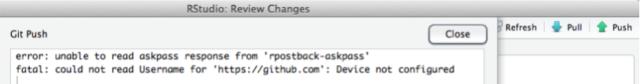

### Do I need a computer?

Yes. This class is heavily computer oriented. Ideally, you should bring your laptop with you to each class. We will regularly do coding exercises during lecture. If this is not an option for you, let me know as early as possible so we can work out a solution.

### How do I succeed in this class?

* Complete readings before the material is covered in class, and then review again afterwards.

* Participate actively in class. If you don't understand something, I can guarantee no one else does either. I have a Ph.D., and I've been doing this for more than 10 years. It's hard for me to remember what it's like to be you and what you don't know. Say something! I want you to learn this stuff, and I love to explain more carefully.

* Come to office hours. Again, I like explaining things.

* Do the assignments --- start early and make sure you attempt and understand all questions. I can't emphasize this enough. The biggest mistake you can make is to convince yourself that you know something because a classmate did it on the HW. Make sure you understand every step and how to get there.

* Do not procrastinate --- don’t let a unit go by with unanswered questions as it will just make the following unit’s material even more difficult to follow.

### How can I get better at R?

I get this question a lot. The answer is almost never "go read the book _How to learn R fast_" or "watch the video on _FreeRadvice.com_". To learn programming, the only thing to do is to program. Do your assignments. Redo your assignments. Run through the code in the textbook. Ask yourself why we used one function instead of another. Ask questions. Play little coding games. If you find yourself wondering how some bit of code works, run through it step by step. Print out the results and see what it's doing. If you take on these kinds of tasks regularly, you will improve rapidly. Coding is an _active_ activity just like learning Spanish. You have to practice constantly. For the same reasons that it is difficult/impossible to learn Spanish just from reading a textbook, it is difficult/impossible to learn R just from reading/watching.

When I took German in 7th grade, I remember my teacher saying "to learn a language, you have to constantly tell lies". What he meant was, you don't just say "yesterday I went to the gym". You say "yesterday I went to the market", "yesterday I went to the movies", "yesterday she went to the gym", etc. The point is to internalize conjugation, vocabulary, and the inner workings of the language. The same is true when coding. Do things different ways. Try automating regular tasks. 

If you are still looking for more reading, there are some links on my [website](https://dajmcdon.github.io/code-links/) as well as many other places accessible by [Google](http://www.google.com/).

### My code doesn't run. What do I do?

This is a constant issue with code, and it happens to everyone. My first recommendation is to _start early_ to maximize the time to complete an assignment. The assignments don't take too long, unless you have code issues which may add substantially to your time to completion. The following is a general workflow for debugging stuck code.

0. If the code is running, but not doing what you want, see [below](#how-to-write-good-code).

1. Read the Error message. It will give you some important hints. Sometimes these are hard to parse, but that's ok.
```{r bad-code, error=TRUE}
set.seed(12345)
y = rnorm(10)
x = matrix(rnorm(20),2)
linmod = lm(y~x)
```
This one is a little difficult. The first stuff before the colon is telling me where the error happened, but I didn't use a function called `model.frame.default`. Nonetheless, after the colon it says `variable lengths differ`. Well `y` is length 10 and `x` has 10 rows right? Oh wait, how many rows does `x` have?

2. Read the documentation for the function in the error message. For the above, I should try `?matrix`.

3. Google!! If the first few steps didn't help, copy the error message into Google. This almost always helps. Best to remove any overly specific information first.

4. Ask your classmates on Slack. In order to ask most effectively, you should probably provide them some idea of how the error happened. See the section on [MWEs](#minimal-working-examples) for how to do this.

5. Come see me or the TA. Note that it is highly likely that I will ask if you did the above steps first. And I will want to see your minimal working example (MWE). 

**If you come to my office, bring your computer! Or Slack me your MWE. Or both. But not neither.** If the error cannot be reproduced in my presence, it is very unlikely that I can fix it.

### Minimal working examples

An MWE is a small bit of code which will work on anyone's machine and reproduce the error that you are getting. This is a key component of getting help debugging. When you do your homework, there's lots of stuff going on that will differ from most other students. To allow them (or me, or the TA) to help you, you need to be able to get their machine to reproduce your error (and *only* your error) without much hassle.

I find that, in the process of preparing an MWE, I can often answer my own question. So it is a useful exercise even if you aren’t ready to call in the experts yet. The process of stripping your problem down to its bare essence often reveals where the root issue lies. My above code is an MWE: I set a seed, so we both can use _exactly_ the same data, and it's only a few lines long without calling any custom code that you don't have.

For a good discussion of how to do this, see [stackexchange](https://stackoverflow.com/questions/5963269/how-to-make-a-great-r-reproducible-example-aka-mcve-minimal-complete-and-ver/5963610#5963610).

### How to write good code

This is covered in much greater detail in the lectures, so see there. Here is my basic advice.

1. Write script files (which you save) and source them. Don't do everything in the console. `R` (and python and Matlab and SAS) is much better as a scripting language than as a calculator.
2. Don't write anything more than once. This has three corollaries:
    a. If you are tempted to copy/paste, don't.
    b. Don't use _magic numbers_. Define all constants at the top of the script.
    c. Write functions.
3. The third is __very important__. Functions are easy to test. You give different inputs and check whether the output is as expected. This helps catch mistakes.
4. There are two kinds of errors: syntax and function.  
    * The first R can find (missing close parenthesis, wrong arguments, etc.)  
    * The second you can only catch by thorough testing 
5. Don't use __magic numbers__. 
6. Use meaningful names. Don't do this:
```{r general-advice}
data("ChickWeight")
out = lm(weight~Time+Chick+Diet, data=ChickWeight)
```
7. Comment things that aren't clear from the (meaningful) names.
8. Comment long formulas that don't immediately make sense: 
```{r general-advice-2}
garbage = with(ChickWeight, 
               by(weight, Chick, 
                  function(x) (x^2+23)/length(x))) ## WTF???
```

### Git and Github

Most issues can be fixed by examining [Happy Git with R](http://happygitwithr.com), so please read carefully first (see week 1 reading assignment).

Some other common issues:

1. Installing Git. On Macs, this is done already. Although, if your system is really old, it may be an old version. On Windows, the TA and I can attempt to help, but your best bet is likely to go to a campus STC and get their help. But again, see the reading first.

2. rpostback-askpass error

Sometimes when RStudio won't push committed changes to GitHub, RStudio displays an `rpostback-askpass` error:

```
error: unable to read askpass response from 'rpostback-askpass'
fatal: could not read Username for 'https://github.com': Device not configured
```



To fix it, open the shell: Tools > Shell.

`git push -u origin master`


3. Git not detected on system path

After downloading and installing git, sometimes RStudio is unable to locate git and will show the following error:


It is important to make sure you do in fact have git installed on your computer first. You can do this by opening up terminal (Mac OSX) or the cmd line (Windows) and typing:

  * `$ which git` for Mac/Linux,
  * `$ where git` for Windows

These commands will tell you where the `git.exe` file is located. Typically it will look something like this: `/usr/local/git/bin/git` or `/usr/bin/git` or some variation of those.

Once confirming the location of `git.exe` you need to tell RStudio where it is. Open up RStudio, go to Preferences and select the Git/SVN option:


In the Git executable area, fill in the path to your git.exe. If RStudio does not let you manually enter your path, select Browse... and navigate to the `git.exe` file. If you are not able to navigate to the file it is likely a hidden file.

On a Mac, to make hidden files visible, close RStudio and do the following:

  * Open Terminal found in Finder > Applications > Utilities.
  * In Terminal, paste the following: ```defaults write com.apple.finder AppleShowAllFiles YES```.
  * Press return.
  * Hold the 'Option/alt' key, then right click on the Finder icon in the dock and click Relaunch.

And then reopen RStudio, go to Preferences > Git/SVN > Browse... and you should be able to navigate to the `git.exe`

You will then need to create an RSA Key. You can do this by clicking on 'Create RSA Key...' at the bottom of the Git/SVN panel, then 'View public key'. Copy the key you see, and add it to your GitHub account by using the instructions provided [here](https://help.github.com/articles/generating-ssh-keys/#step-4-add-your-ssh-key-to-your-account).

Source: Fixes for 2 and 3 come from the [OHI manual](http://ohi-science.org/manual/#toolbox-troubleshooting) but appear so frequently in this class that I am quoting here.
