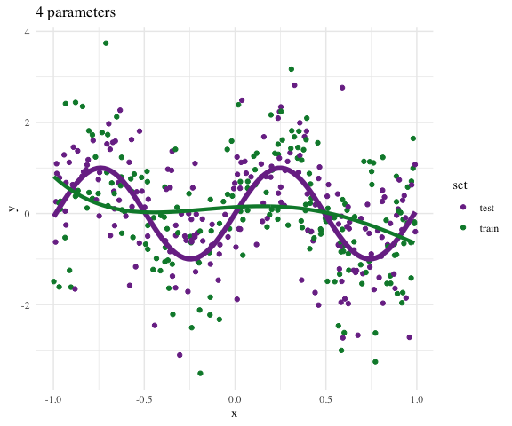

This is a course in advanced data analysis. Based on the theory of linear models covered in S431, this course will focus on applying many types of data analysis methods to interesting datasets. The focus will be dealing with and describing data rather than on particular methods per se.

The course combines analysis with methodology and computational aspects. It treats both the "art" of understanding unfamiliar data and the "science" of analyzing that data in terms of statistical properties. The focus will be on practical aspects of methodology and intuition to help students develop tools for selecting appropriate methods and approaches to problems in their own lives.

I expect that the material should be appropriate and interesting to students coming from either statistics or informatics/computer science. I will make an effort to provide necessary background so that lectures are accessible to both populations.

We will put special emphasis on learning to use certain tools common to companies which actually _do_
data science. This includes [Slack](https://stats-432sp2020.slack.com/), [GitHub](https://github.com/stats-432sp2020), [Rstudio](https://www.rstudio.com), and [Rmarkdown](http://rmarkdown.rstudio.com/). As such, we will
require the use of these technologies.

## Where to find things.

* The most up-to-date materials are on [Github](https://github.com/stats-432sp2020).
* Lecture handouts will be posted on the [Schedule](schedule.html) page once available. 
* Course communication on [Slack](http://stats-432sp2020.slack.com).
